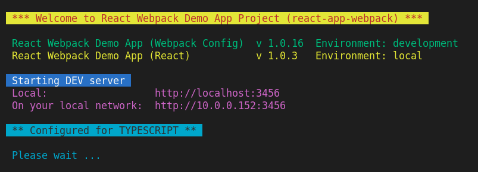
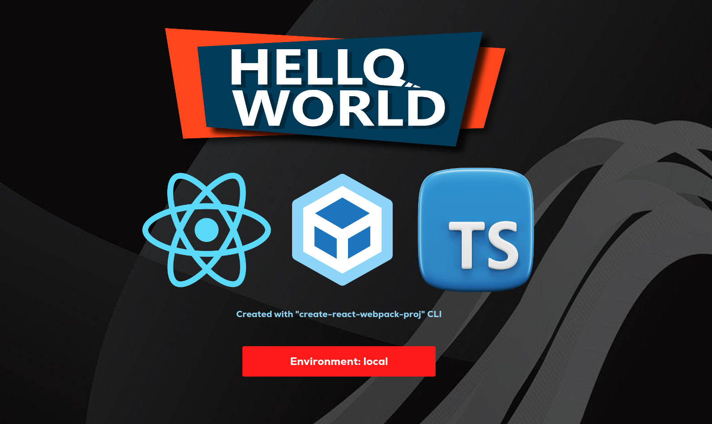
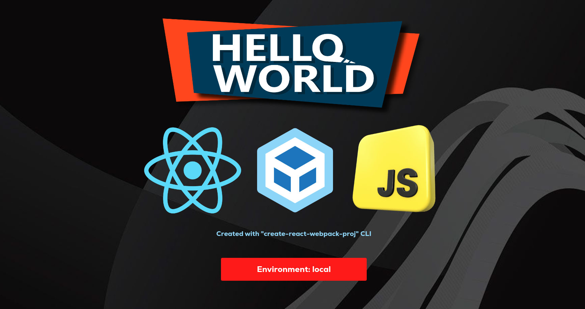

# react-webpack-template
A fully configured React webpack boiler plate. It includes ***Tailwind***, ***Environments***, ***ESLint***, ***TypeScript*** (**ts**, **tsx**) and regular ***JavaScript*** (**js**, **jsx**). It is fully customizable. You can remove, add, or modify default configuration according to your requirements.

In this latest release (version **1.0.3**), I have added full configuration and implementation of ***TypeScript***. You can now run your project development in ***TypeScript*** or ***JavaScript*** via a simple variable setting in package.json.

**NOTICE**: **The default development setting is TypeScript. If you prefer regular JavaScript instead, you must set variable isTypeScript to false in package.json**!

## TypeScript Development

To run your project in TypeScript, go to the package.json file, and set variable **isTypeScript** to **true** (by default this is set to true). Then, in a terminal, type `npm start` to start the app. As you can see from the picture below, the terminal start-up display confirms that the project is configured for TypeScript:
 

After loading completes, you should see the following page:

**Notice the TypeScript (TS) logo**. The TypeScript Hello World sample files are located in the **src/ts/** directory. You should see **HelloWorld.tsx** and **index.tsx**. Notice that the import feature of PNG image files is configured in **global.d.ts** located in the root of the project. Here, you can add support for other image types and  other global declarations.

Notice that when variable **isTypeScript** in package.json is set to **true**, this development setup expects **.ts** and **.tsx** files. Therefore, you must code in TypeScript and be familiar with it.

## JavaScript Development

To run your project in regular JavaScript, go to the package.json file, and set variable **isTypeScript** to **false**. Then, in a terminal, type `npm start` to start the app. As you can see from the picture below, the terminal start-up display confirms that the project is configured for regular JavaScript:

After loading completes, you should see the following page:

**Notice the JavaScript (JS) logo**. The JavaScript Hello World sample files are located in the **src/js/** directory. You should see **HelloWorld.js** and **index.js**. Notice that ***tsconfig.json*** and ***global.d.ts*** have no effect in this development mode.

Notice that when variable **isTypeScript** in package.json is set to **false**, this development setup expects **.js** and **.jsx** files. Therefore, you must code in regular JavaScript and be familiar with it.

Optionally, if you'll never use TypeScript, and don't care to have the option for TypeScript, you can remove TypeScript as follows:

- Uninstall all TypeScript packages listed below (npm uninstall):
  - @babel/preset-typescript
  - @typescript-eslint/eslint-plugin
  - @typescript-eslint/parser
  - ts-loader
  - typescript
  - @types/react
  - @types/react-dom
- Remove all **TypeScript configuration files** listed below:
  - tsconfig.json
  - global.d.ts
- In **webpack.config.js**, remove lines **16**, **21**, and **115 to 120**. Also, in line **31** change the value of variable **entry** to just  **/src/index.js**.
- In **.babelrc**, remove line 5.
- In **package.json**, remove variable **isTypeScript**.
- Delete file **.eslintrc.json** and **rename** ***.eslintrc_js_only.json*** to **.eslintrc.json**.
- Delete the **ts** folder with the sample files in it.

Again, removing TypeScript is not necessary to develop in regular JavaScript.

## Build

To build your code do **npm** **run build:*x***, where ***x*** is the environment you wish to build for. For example, to build production you would do **npm run build:*prod***.

## Running your React App in Microsoft IIS Webserver

Please note that file **web.config** in the **public** directory, is the rewrite url configuration for Microsoft IIS Webserver. This configuration file instructs IIS to let React Routes handle the app routing. You don't have to worry about the web.config file when you do a release, because the build process (npm run build:x) takes care of adding the web.config file in the build bundle.  Also note, that you must first install **Rewrite URL extension package** in your IIS.

If you use **NGINX Webserver** instead, follow the simple NGINX instructions to configure a React App routing. If you'll be running your React App in other webservers you'll need to check how to run a React App with your webserver vendor.

Outside of IIS, the web.config file will not be needed. You can comment out line **201** in your **webpack.config.js**. This will prevent the build process from adding the web.config file in your build bundle.

## Other Considerations

In directory **src**, the sub-directories **js** and **ts** are used for demo purpose to show TypeScript code (folder ts) and non-TypeScript code (folder js).  Once you set variable **isTypeScript** to **true** or **false** in package.json, you'll be using either TypeScript or regular JavaScript based on the value of variable **isTypeScript**. Therefore, there is no need to specify a sub-directory **js** or **ts**. You should start your app code in **src** root directory.

